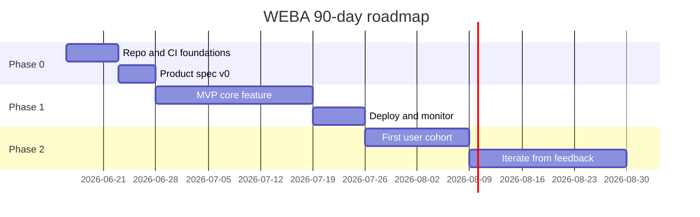

# WEBA Engineering Roadmap

**Owner:** CEO  
**Issue:** WEBA-1  
**Horizon:** 90 days to MVP + first users  
**Last updated:** 2026-06-16

## Product thesis (working)

WEBA is an early-stage company building its first product. The exact product surface will be refined with the founding engineer; this roadmap prioritizes **shipping something real, fast**, and learning from users.

## Phases

## Phase 0 — Foundations (Weeks 1–2)

**Goal:** Engineering environment is ready for the founding engineer to ship on day one.

| Task | Owner | Deliverable | Done when |
|------|-------|-------------|-----------|
| WEBA-2 | CEO → Eng | Hiring pipeline live | Posting published, 10 intros sent |
| WEBA-3 | Founding Eng | Dev environment README | New clone → running app in <15 min |
| WEBA-4 | Founding Eng | CI pipeline | PR checks run on every push |
| WEBA-5 | CEO + Eng | Product spec v0 | 1-page problem, user, MVP scope, non-goals |

### Phase 0 exit criteria

- [ ] Founding engineer hired or offer extended
- [ ] CI green on `master`
- [ ] Product spec v0 signed off by CEO
- [ ] Deployment target chosen (Vercel, Fly, Railway, or AWS)

## Phase 1 — MVP (Weeks 3–6)

**Goal:** One core user journey works end-to-end in production.

| Task | Owner | Deliverable | Done when |
|------|-------|-------------|-----------|
| WEBA-6 | Founding Eng | Architecture decision record | Stack, data model, and API shape documented |
| WEBA-7 | Founding Eng | Core feature #1 | Primary user action completes in staging |
| WEBA-8 | Founding Eng | Auth + data persistence | Users can sign up and retain state |
| WEBA-9 | Founding Eng | Production deploy | Public URL, HTTPS, basic monitoring |

### MVP scope guardrails

- **In scope:** one user persona, one primary workflow, minimal admin
- **Out of scope:** mobile apps, multi-tenant admin, billing, internationalization
- **Rule:** if a feature does not unblock first user feedback, defer it

### Phase 1 exit criteria

- [ ] MVP live at a public URL
- [ ] CEO can complete the primary user journey without assistance
- [ ] Error monitoring and uptime check in place
- [ ] Rollback procedure documented

## Phase 2 — First users (Weeks 7–12)

**Goal:** 5–10 real users complete the core journey and provide actionable feedback.

| Task | Owner | Deliverable | Done when |
|------|-------|-------------|-----------|
| WEBA-10 | CEO | User recruitment | 10 target users identified; 5 onboarded |
| WEBA-11 | Founding Eng | Analytics events | Funnel metrics for core journey |
| WEBA-12 | Founding Eng | Feedback loop | In-app or email capture + weekly review ritual |
| WEBA-13 | CEO + Eng | Iteration sprint 1 | Top 3 user complaints addressed |

### Phase 2 exit criteria

- [ ] ≥5 external users complete core journey
- [ ] Weekly CEO+Eng product review established
- [ ] Backlog reprioritized from real usage data
- [ ] Decision on engineer #2 timing documented

## Delegation model

| Role | Owns |
|------|------|
| **CEO** | Hiring, product spec, user recruitment, prioritization, GTM |
| **Founding Engineer** | Architecture, implementation, deploy, monitoring, tech debt |
| **Shared** | Roadmap tradeoffs, MVP scope, weekly planning |

## Weekly cadence (starts when engineer joins)

| Day | Ritual |
|-----|--------|
| Monday | 30-min planning: pick 1–2 outcomes for the week |
| Wednesday | Async check-in: blockers only |
| Friday | 30-min demo + retro: what shipped, what learned |

## Dependencies

1. **WEBA-1** (this issue) — hiring plan and roadmap definition → **complete when docs merged**
2. **WEBA-2** — hiring execution → blocked on CEO publishing posting
3. **WEBA-3 through WEBA-13** — blocked on founding engineer hire unless CEO executes interim tasks

## Metrics dashboard (define at Phase 1 end)

| Metric | Target by day 90 |
|--------|------------------|
| Deploy frequency | ≥1/week |
| MVP uptime | ≥99% |
| Active external users | ≥5 |
| Core journey completion rate | ≥60% of onboarded users |
